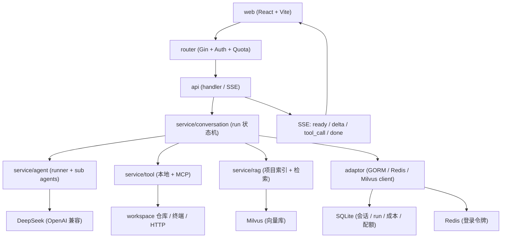

# Code Analyse Agent

面向代码仓库与数据库的 AI 分析应用：输入一个 Git 仓库地址或本机项目路径，系统会把它克隆/挂载到工作区、建立项目级语义索引，然后用一个会调用工具的多 Agent 链路，产出结构化的代码分析报告、项目问答与数据库报表。

后端 Go（Eino + Gin），前端 React + Vite，内置 SSE 流式输出、审批中断恢复、崩溃续跑、账号鉴权与成本/配额统计。

## 功能特性

| 能力 | 说明 |
| ---- | ---- |
| 仓库分析 | 给出 Git URL 或本机路径，自动 fetch 到工作区并输出固定 8 节的 Markdown 报告（含 Mermaid 图）。 |
| 项目问答 | 针对"当前项目"连续追问，例如某接口在哪实现、配置怎么加载、调用链怎么串。 |
| 数据库报表 | 连接业务库，只读查询后产出中文 Markdown 报表（只允许 SELECT/SHOW/DESCRIBE 等只读语句）。 |
| 项目级 RAG | 按项目隔离 Milvus collection，符号级切分 + 中文查询改写 + RRF 融合 + 重排，语义检索项目代码。 |
| 工具调用 | 本机终端命令、HTTP 请求、项目扫描/搜索、文件读取、Git 仓库拉取、RAG 检索，以及 MCP 外部工具。 |
| 流式对话 | SSE 逐事件下发（`delta`/`reason`/`tool_call`/`tool_result`/`done`），前端 Markdown + Mermaid 渲染。 |
| 断连续传 | run 与 HTTP 请求解绑，客户端断线/刷新后按 `Last-Event-ID` 回放并继续跟随。 |
| 审批中断恢复 | 高危终端命令需人工审批，审批后从 checkpoint 复用同一条 run 继续执行。 |
| 崩溃续跑 | 进程重启时把遗留 `running` run 标记为 `interrupted`，前端可回放已落库内容。 |
| 账号与配额 | 账号密码登录（Redis 不透明令牌）+ 游客免密登录，按用户区分配额与成本。 |
| 会话管理 | 会话列表/详情/删除、只读分享链接、调用链路查看。 |
| 可观测 | OpenTelemetry tracing（OTLP / stdout 回退），结构化日志。 |

## 架构总览

请求从 Gin 路由进入，经鉴权与配额中间件后落到 `api` 层；`service` 层负责编排业务，把事件写入 run 状态机、广播给在线订阅者，并按需调用各类 Agent 与工具；`adaptor` 层封装 SQLite、Redis、Milvus 与成本/会话/审批等仓储。



## 目录结构

```text
.
├── main.go                 # 进程入口：加载配置、初始化 tracing、起 HTTP 与 MCP 服务
├── agent_code_local.yml    # 本地配置（含密钥，已被 .gitignore 忽略）
├── api/                    # HTTP handler：chat / session / auth / cost / quota / rag / sse
├── router/                 # 路由注册 + 鉴权、配额、tracing 中间件
├── service/
│   ├── agent/              # 主 Agent 与子 Agent：repo_analyzer / project_qa / db_report
│   ├── conversation/       # 对话编排、run 状态机、断连续传、审批恢复
│   ├── rag/                # 全局与项目级索引、切分、查询改写、RRF 融合
│   ├── tool/               # 工具实现：终端、HTTP、扫描、搜索、读文件、repo_fetch、RAG 检索
│   ├── auth/               # 登录认证与令牌签发/校验
│   ├── cost/  quota/       # 成本与配额统计
│   └── dto/ do/ consts/    # 传输对象、领域对象、常量
├── adaptor/                # 基础设施适配：SQLite(GORM) / Redis / Milvus / 各仓储实现
├── mcpserver/              # 对内暴露配额与成本的 MCP Server
├── common/ utils/ config/  # 公共常量、日志、追踪、配置加载
├── web/                    # React + Vite 前端
├── docs/                   # 设计与实现说明（run 崩溃续跑等）
├── spec/  eval/  e2e/      # 规格、评测脚本、端到端测试
├── deploy/ scripts/        # 远程模型脚本、服务器部署脚本
└── .github/workflows/      # CI：构建后端与前端并发布 Release
```

## 快速开始

### 环境要求

- Go `1.26.5`（见 `go.mod`）
- Node.js `20+`（前端构建）
- Redis（登录令牌存储，连不上会启动失败）
- Milvus `2.6.x`（仅在 `rag.enabled: true` 时需要）
- 可用的模型与 embedding / rerank 服务

### 1. 准备配置

本地配置写在项目根目录的 `agent_code_local.yml`，该文件含真实密钥、已被 `.gitignore` 忽略，不会进仓库。最小可运行配置：

```yaml
server:
  app_name: "edu.agent.code"
  http_addr: ":8088"
  log_level: debug

sqlite:
  path: data/edu.agent.code.db

deepseek:
  base_url: "https://api.deepseek.com"
  model: deepseek-flash
  api_key: "<你的 key>"

redis:
  addr: "<host>:6379"
  username: ""
  password: ""
  db: 0

auth:
  token_ttl_hours: 168
  accounts:
    - { username: "admin", password: "<密码>", plan: "pro" }
  guest:
    enabled: true
    plan: "plus"
    daily_quota: 30

workspace:
  root: "<绝对路径>/workspace"
  repos_dir: "<绝对路径>/workspace/repos"

rag:
  enabled: true
  docs_root: "<绝对路径>/docs/test_doc"
  embedding:
    base_url: "https://open.bigmodel.cn/api/paas/v4"
    model: embedding-3
    api_key: "<你的 key>"
    dimensions: 2048
  milvus:
    address: "<host>:19530"
    collection: edu_agent_code_docs
  rerank:
    enabled: true
    base_url: "https://open.bigmodel.cn/api/paas/v4/rerank"
    model: rerank
    api_key: "<你的 key>"
```

把 `rag.enabled` 设为 `false` 可关闭 Milvus 与语义索引，此时不会创建 Milvus 客户端。`auth` 与 `redis` 两段是必需的，缺失会以 `redis addr can't be empty` 启动失败。

### 2. 启动后端

```bash
go mod tidy
go run .
# 默认监听 :8088，健康检查 GET /healthz
```

### 3. 启动前端

```bash
cd web
npm ci        # 或 pnpm install
npm run dev   # 开发模式
npm run build # 产物输出到 web/dist
```

前端开发模式默认请求同源 `/api`，生产环境由 Nginx 反代到后端（见 `scripts/server/` 下的示例配置）。

## 配置说明

核心配置项（完整字段见 `config/config.go` 与 `agent_code_local.yml`）：

| 配置段 | 作用 |
| ------ | ---- |
| `server` | 应用名、监听地址、日志级别。 |
| `sqlite` | 本地数据库路径，存放会话、run、消息、成本、配额、审批、分享。 |
| `deepseek` | 主对话模型（OpenAI 兼容协议）。 |
| `model_price` | 各模型单价，用于成本计算。 |
| `workspace` | 仓库工作区根目录、克隆超时、仓库大小上限、目录逃逸开关。 |
| `database_report` | 数据库报表 Agent 使用的只读业务库连接。 |
| `agents` | 各 Agent 的最大迭代轮次（compose / project_qa / repo_analyzer / db_report）。 |
| `rag` | 是否启用、文档根、分片参数、embedding、Milvus、rerank、中文查询改写。 |
| `skills` | 技能中间件目录（默认 `~/.claude/skills`）与工具名。 |
| `mcp` / `mcp_server_self` | 外部 MCP 工具来源，以及对内暴露的 MCP Server。 |
| `redis` / `auth` | 令牌存储与账号、游客登录配置。 |
| `context_compact` | 上下文压缩：按窗口占比与消息条数触发，折叠较早对话为结构化摘要。 |

## API 概览

除白名单外，所有接口都需要 `Authorization: Bearer <token>`。白名单：`/healthz`、`/api/version`、`/api/auth/login`、`/api/auth/guest`、`/api/sessions/shared/info`。

| 方法 | 路径 | 说明 |
| ---- | ---- | ---- |
| GET | `/healthz` | 健康检查 |
| GET | `/api/version` | 版本信息 |
| POST | `/api/auth/login` | 账号密码登录，返回令牌 |
| POST | `/api/auth/guest` | 游客免密登录（按 IP + 浏览器指纹派生身份） |
| POST | `/api/auth/logout` | 吊销当前令牌 |
| GET | `/api/quota/today` | 当天调用量 |
| GET | `/api/cost/daily` | 当天成本（按登录用户） |
| GET | `/api/cost/by_user` | 按用户统计成本 |
| GET | `/api/cost/by_tool` | 按工具统计成本 |
| GET | `/api/sessions` | 会话列表 |
| GET | `/api/sessions/info` | 会话详情（含历史消息，分页） |
| DELETE | `/api/sessions/delete` | 删除会话 |
| POST | `/api/sessions/share` | 创建只读分享 |
| DELETE | `/api/sessions/share` | 撤销只读分享 |
| GET | `/api/sessions/shared/info` | 读取只读分享（无需登录） |
| POST | `/api/rag/retriever` | 全局文档检索 |
| GET | `/api/rag/project_status` | 项目代码语义索引状态 |
| POST | `/api/chat/completion` | 非流式对话，阻塞返回 |
| POST | `/api/chat/stream` | 流式对话（SSE） |
| GET | `/api/chat/stream/run` | 断连续传：按 `Last-Event-ID` 回放并继续跟随 |
| GET | `/api/chat/run/active` | 查询会话下仍可续跑的活跃 run |
| POST | `/api/chat/resume` | 审批中断后恢复对应 run |

## 关键机制

### run 与请求解绑

每次对话先同步落一条 `chat_runs`（`running`），再在 `context.WithoutCancel` 起的 goroutine 里执行。客户端断连只结束事件转发，不影响执行与落库。所有 run 内事件先写 `chat_run_events`（自增主键即 SSE 游标 `seq`），再广播给在线订阅者，因此客户端拿到的每个 `seq` 一定可以回放。详见 [docs/run-crash-resume.md](docs/run-crash-resume.md)。

```text
POST /api/chat/stream ─► StartChatRun（落 chat_runs）
                            │
                            └─► go executeRun（脱离请求 ctx）
                                   │
                                   ├─ 每个事件：AppendEvent(seq) ─► Publish ─► SSE id:<seq>
                                   └─ finishRun(done / failed / interrupted)

前端断线 ─► GET /api/chat/stream/run?after=<seq> ─► 回放 + 实时跟随
```

### 审批中断与恢复

高危终端命令会经 `terminal.ApprovalMiddleware` 中断本轮，把 pending 与 checkpoint 写入 `approvals`，run 落到 `interrupted`。用户审批后 `POST /api/chat/resume` 用 pending 的 checkpoint 命中同一条 run，`seq` 连续、不重复回放，恢复后继续产出事件。

### 项目级 RAG 隔离

`repo_fetch` 成功后会回写会话的"当前项目"并异步触发建索引。每个项目使用独立 Milvus collection（`基础名_项目ID`），写入与召回都只针对该集合，检索侧再用元数据二次校验。切分优先按源码符号结构，失败时回退通用递归切分；查询改写、RRF 融合与重排均可按配置开关。

## 开发与测试

```bash
# 后端
go build ./...
go vet ./...
go test ./...

# 前端
cd web
npx tsc -b
npm run build
npm test
```

端到端测试位于 `e2e/`（`repo_rag_test.go`、`rebuild_project_test.go`），评测脚本位于 `eval/`。

## 部署

CI（`.github/workflows/deploy.yml`）只在 push 到 `main` 时构建并发布 Release `deploy-latest`，产物为：

- `code-analyse-agent.gz`（Linux amd64 后端二进制）
- `web-dist.tar.gz`（前端静态产物）
- `version.json`（commit 与各产物 sha256）

服务器侧由 systemd timer 每分钟执行 `analyse-deploy.sh` 主动拉取 Release，用 `api.github.com` 的 ETag 条件请求判版本、按产物指纹判是否需要重启；下载走镜像链并校验 sha256，后端原子替换 + `/healthz` 健康检查 + 失败回滚。相关脚本在 `scripts/server/`，手动触发用 `scripts/deploy-now.ps1`。

## 安全说明

- 配置文件 `agent_code_local.yml` 含真实密钥，已在 `.gitignore` 中，切勿提交。
- 数据库报表 Agent 只允许只读 SQL，禁止写库/改表/删表。
- 终端工具对高危命令强制人工审批，并支持目录逃逸拦截（`workspace.enable_escaped`）。
- 会话与 run 均做用户归属校验，跨账号读取会被拒绝。

### TODO

- MCP Server（`mcp_server_self.http_addr`）目前无鉴权。
- `/api/cost/by_user`、`/api/cost/by_tool` 对任意登录用户开放，会暴露全站成本明细。
- 流式分片逐条落库存在写放大，大仓库单轮可达上万行事件。
- 画像缺少独立的回读接口，刷新后 UI 不会自动从服务端加载画像。
